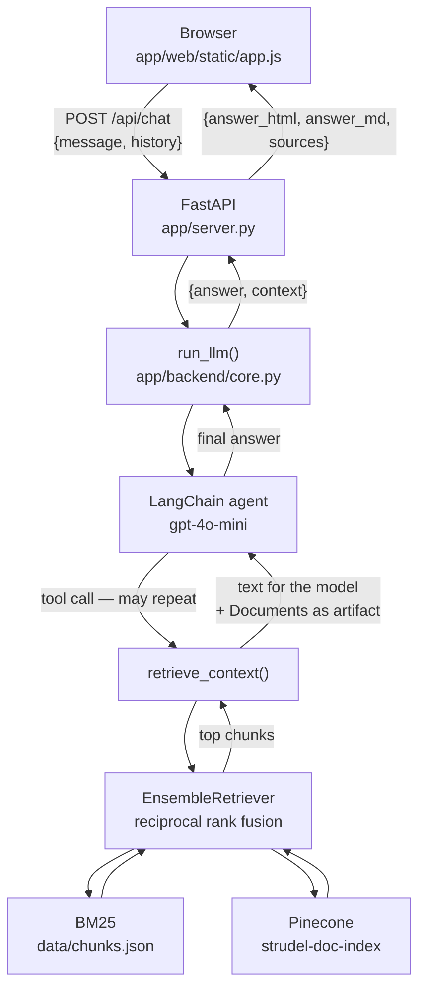
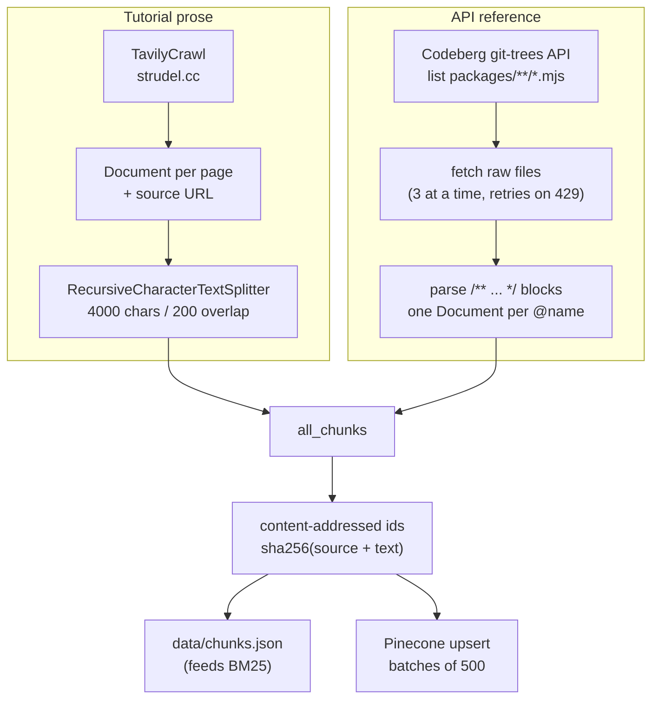

# Architecture

How StrudelAssistant is put together, why the pieces are shaped the way they are,
and which parts you have to keep in step with each other.

For "how do I change X", see [extending.md](extending.md).

## The two pipelines

The project is really two programs that only meet through stored data:

| | Ingestion | Serving |
| --- | --- | --- |
| Entry point | `app/ingestion.py` | `app/server.py` |
| When | Run by hand, rarely | Every request |
| Cost | Paid and slow (crawl + embed thousands of chunks) | One model call per question |
| Writes | `data/chunks.json`, Pinecone index | nothing |
| Reads | the web | `data/chunks.json`, Pinecone index |

Ingestion builds the corpus. Serving answers questions from it. Nothing in the
serving path ever writes to the corpus, so you can restart, edit and redeploy
the app freely without touching the index.

## Serving: what happens when you ask a question



Step by step:

1. **The browser posts the question plus prior turns.** `history` deliberately
   excludes the current question — the server appends it last. Without history
   the agent cannot resolve follow-ups like *"now add reverb to that"*.
2. **`server.py` hands off to `run_llm`.** The endpoint is a plain `def`, not
   `async def`, so FastAPI runs it in a worker thread — `run_llm` blocks on the
   network and would otherwise stall the event loop for every other request.
3. **The agent decides whether to search.** The system prompt instructs it to
   always call `retrieve_context` before answering anything about Strudel, and
   to search again with different wording if the first pass is unhelpful. So one
   question can produce several retrievals.
4. **Retrieval is hybrid** (see below).
5. **The agent loops** — tool call, observation, maybe another tool call — until
   it produces a plain text answer. That is the last message in the transcript.
6. **`run_llm` walks the whole transcript** collecting retrieved documents from
   every `ToolMessage`, and returns `{answer, context}`.
7. **`server.py` renders the markdown to HTML** and de-duplicates the sources.
8. **The browser decorates the HTML**: every fenced code block becomes a
   playable pattern module.

### Why retrieval is hybrid

`_build_retriever()` in `core.py` merges two retrievers with
`EnsembleRetriever` (reciprocal rank fusion), weighted 50/50, `k=10` each:

- **BM25** is lexical. It matches literal tokens, which is what you need for
  exact function names — a query for `lpf` should surface the `lpf` reference
  entry, and dense embeddings sometimes rank short function names poorly.
- **Pinecone** is semantic. It matches paraphrases — *"how do I make it sound
  muffled"* should reach the low-pass filter docs even though no word overlaps.

If `data/chunks.json` is missing, BM25 cannot be built and the retriever
silently degrades to vector-only, logging a warning. The app still works; it
just gets worse at exact-name lookups.

### The corpus has two very different halves

`retrieve_context` puts a `Source:` URL in front of every chunk, and the system
prompt tells the model to use that field to tell the halves apart:

- **Tutorial prose** from `strudel.cc/workshop`, `/learn`, `/recipes` — crawled
  web pages, split into 4000-character chunks. Good for concepts.
- **API reference entries** — one document per Strudel function, built from the
  JSDoc comment above that function in the Strudel source. Good for exact
  syntax, parameter types and synonyms.

The prompt tells the model to trust the reference entries over its own prior
knowledge, because Strudel is a moving target and the model's training data may
describe an older version or plain TidalCycles.

### How sources survive to the UI

This is the least obvious mechanism in the codebase and worth understanding
before you change the tool.

`retrieve_context` is declared `@tool(response_format="content_and_artifact")`,
so it returns a **2-tuple**:

```python
return serialized, retrieved_docs
#      └ str: what the MODEL sees (goes into the prompt)
#              └ any Python object: the model never sees this
```

LangChain stores the second element on the resulting `ToolMessage.artifact`.
That is how the original `Document` objects — with their metadata — reach the
application intact, instead of being flattened into prompt text that would have
to be re-parsed. `run_llm` then scans the transcript for `ToolMessage`s and
collects those artifacts.

Consequence: the citations in the UI's **Sources** panel are *what was
retrieved*, which is not necessarily *what the model cited* in its prose. Both
are shown, and they are deliberately different things.

## Ingestion: building the corpus



Two things deserve explanation:

**Why scrape the Strudel source at all.** Strudel's function reference is not a
crawlable web page — it is a panel inside the REPL, rendered client-side from
data baked into the JS bundle at build time. That data comes from JSDoc comments
in `packages/**/*.mjs`. Re-parsing those comments is the only way to get the
reference into a RAG corpus. `fetch_reference_docs()` degrades to an empty list
on network failure, so a Codeberg outage doesn't abort the whole run — but it
does silently produce a corpus with no API reference in it.

**Why reference entries are not split.** Each documented function is already one
self-contained unit of meaning. Running it through the text splitter would cut
examples away from the description they belong to. Only the crawled prose is
split.

**Content-addressed ids.** `_chunk_id()` hashes `source + page_content`, so
re-running ingestion over unchanged pages upserts the *same* vector rather than
adding a duplicate. See the traps section for the flip side of this.

## The frontend

No bundler, no framework, no build step: `app/web/index.html` plus one
stylesheet and one script. Three moving parts.

**1. The transport** — one audio engine, so at most one thing plays at a time.
`activeBtn` tracks which control is the current source; `setActive()` resets the
previous one. The lane in the top rail is driven by `repl.scheduler.now()`,
which returns the current **cycle position**, so the sweep is Strudel's real
clock rather than an animation at a guessed tempo.

**2. Pattern modules** — `decoratePatches()` finds every `pre > code` in a
rendered answer and replaces it with a panel carrying Play, Edit and Copy. The
code is highlighted by a small hand-rolled tokenizer (`highlight()`), which also
dims mini-notation operators *inside* strings so sound names stay legible.

**3. The editor** — a transparent `<textarea>` sitting exactly on top of a
highlighted copy of the same text. Editing stays native (caret, selection, undo,
IME) while the text underneath is coloured. `⌘/Ctrl+Enter` re-evaluates the
buffer, which swaps the pattern without stopping the transport — the normal
live-coding gesture. Its width is a single custom property, `--editor-w`, read
by the panel, by the body offset that shifts the conversation and by the
composer, so dragging the grip resizes both columns at once.

Strudel reports failures by dispatching a `strudel.log` CustomEvent on
`document` rather than by rejecting `evaluate()`. The app listens for those and
shows the message in the rail readout; without that, a broken pattern would
light the transport and play nothing.

## Data and contracts

**`POST /api/chat`**

```jsonc
// request
{ "message": "what does lpf do?",
  "history": [{ "role": "user"|"assistant", "content": "..." }] }

// 200
{ "answer_html": "<p>…</p>",   // markdown rendered server-side
  "answer_md":   "…",          // raw markdown, kept for the next turn's history
  "sources":     ["https://…"] // de-duplicated, first-seen order
}

// 4xx / 5xx
{ "error": "a sentence saying what to fix" }
```

The client stores `answer_md` (not the HTML) in its history, so the next turn
sends the model the same text it produced.

**`data/chunks.json`** — a flat array, one object per chunk:

```jsonc
{ "id": "<sha256 of source + content>",
  "page_content": "…",
  "metadata": { "source": "https://…", "type": "api-reference", "name": "lpf", "tags": [...] } }
```

`metadata.source` is load-bearing: it is what the tool puts in front of each
chunk and what the UI cites. `type`/`name`/`tags` are only present on API
reference entries.

## Invariants and traps

These are the things that will bite you.

**The embedding model must match in two places.** `ingestion.py` and `core.py`
both construct `OpenAIEmbeddings(model="text-embedding-3-small")`. Query vectors
and stored vectors must come from the same model or similarity search returns
noise. Changing it means changing both *and* re-indexing from scratch — and the
Pinecone index has to be recreated with the new dimension (1536 for this model).

**BM25 and Pinecone drift apart across re-runs.** `chunks.json` is *overwritten*
each run, but Pinecone is *upserted* into. When a chunk's text changes it gets a
new id, the new vector is written, and the vector under the old id is left
orphaned in the index forever. Over several runs the vector side accumulates
stale content the lexical side no longer has. If retrieval starts surfacing
documentation that no longer exists on the site, clear the index and re-ingest.

**`chunks.json` must correspond to what is in Pinecone.** They are two views of
one corpus. Copying in a `chunks.json` from elsewhere, or re-ingesting without
committing the new dump, makes the two retrievers disagree.

**Imports depend on how you launch.** `core.py` does `from logger import ...`
and `server.py` does `from backend.core import ...` — both resolve because
`app/` ends up on `sys.path`. `server.py` inserts its own directory explicitly,
so `uv run python app/server.py` and `uvicorn server:app` both work. Move these
files and the imports break.

**`core.py` does real work at import time.** Importing it builds the BM25 index
from `chunks.json` and opens the Pinecone handle. `server.py` therefore imports
it lazily, behind a lock, warmed by a background thread at startup — so the page
loads instantly and a missing API key surfaces as a readable message in the chat
instead of a stack trace at boot.

**A fresh agent is built per request.** `run_llm` calls `create_agent(...)` on
every call, rebuilding the graph each time. Fine at this scale, wasteful at any
other; see [extending.md](extending.md).

**Answer HTML is rendered with raw HTML disabled.** `MarkdownIt("commonmark",
{"html": False})` escapes any HTML in the model's output. Keep it that way —
the answer text is derived from crawled third-party content.

## Known rough edges

Present in the code as committed, none of them load-bearing:

- `ingestion.py`'s module docstring says it crawls `python.langchain.com`. It
  crawls `strudel.cc`.
- `Chroma` is imported in `ingestion.py` but never used (and `langchain-chroma`
  is a dependency only because of it).
- `tavily_extract` and `tavily_map` are constructed but unused — only
  `tavily_crawl` is. They are there to illustrate the three Tavily tools.
- `ssl_context` is built and never used; the two `os.environ` lines beneath it
  are what actually fix certificate verification on macOS.
- `flask` and `tavily-python` are declared dependencies that nothing imports —
  leftovers from the pre-FastAPI version and from before `langchain-tavily`
  replaced the raw Tavily SDK. (`langsmith` looks unused for the same reason but
  is not: LangChain picks it up through the `LANGSMITH_*` environment variables
  without an explicit import.)
